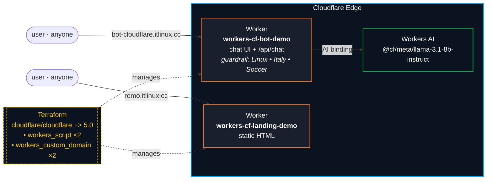

# workers-cloudflare-bot-demo

A small, all-Cloudflare demo:

- **DemoBot** — a topic-bounded chat Worker (Linux • Italy • Soccer), powered by **Workers AI** (`@cf/meta/llama-3.1-8b-instruct`), reachable at `https://bot-cloudflare.itlinux.cc/`.
- **Landing** — a personal landing page on `https://remo.itlinux.cc/` linking to the bot + the source.

No VMs. No Cloudflare Tunnel. No Access policies. Two Workers, two custom domains, one Terraform module.

## Architecture



### Hostnames

| Hostname                       | Backed by                                  | Auth   | Purpose                                        |
| ------------------------------ | ------------------------------------------ | ------ | ---------------------------------------------- |
| `bot-cloudflare.itlinux.cc`    | `workers-cf-bot-demo` (Workers AI)         | Public | Topic-bounded chat: Linux, Italy, soccer       |
| `remo.itlinux.cc`              | `workers-cf-landing-demo` (static HTML)    | Public | Personal landing page                          |

> Note: the apex `itlinux.cc` and `www.itlinux.cc` are managed by a **different** Terraform module (sibling repo). This module deliberately only owns its two subdomains and its two Workers — no overlap with the apex.

> 📍 **Where to find everything in the Cloudflare dashboard:** see [DASHBOARD.md](./DASHBOARD.md) for a complete map of every resource → dashboard URL.
>
> 🛠️ **Want to build it manually instead of with Terraform?** See [MANUAL_SETUP.md](./MANUAL_SETUP.md) for the click-by-click dashboard playbook.

## Prerequisites

1. A Cloudflare account with the zone `itlinux.cc` hosted on it (or change `cf_zone_*` to a zone you own).
2. A Cloudflare API token (scopes below).
3. `terraform` ≥ 1.5
4. Node.js (for `wrangler dev` when iterating locally).

### Cloudflare API token scopes

Create a custom token at <https://dash.cloudflare.com/profile/api-tokens> with **all six** of these:

| Scope                | Type            | Resource selector       | Why                                                                                                |
| -------------------- | --------------- | ----------------------- | -------------------------------------------------------------------------------------------------- |
| Workers Scripts      | Account · Edit  | Your account            | Deploy the two Worker scripts                                                                      |
| Workers AI           | Account · Read  | Your account            | Verify the `AI` binding at deploy time                                                             |
| AI Gateway           | Account · Edit  | Your account            | Create the `demobot-gw` gateway + push Guardrails policy                                           |
| Zone Settings        | Zone · Edit     | `itlinux.cc` (or yours) | Toggle `always_use_https` + `automatic_https_rewrites` at the zone                                 |
| DNS                  | Zone · Edit     | `itlinux.cc` (or yours) | Auto-created CNAMEs for Workers Custom Domains                                                     |
| Workers Routes       | Zone · Edit     | `itlinux.cc` (or yours) | Bind custom hostnames to the Workers                                                               |

Forget any one of these and `terraform apply` fails with `403 Authentication error` on the affected resource. See **[MANUAL_SETUP.md → Step 0b](./MANUAL_SETUP.md#step-0b--cloudflare-api-token-terraform-path-only)** for full details: how to fix scope errors, optional scopes for future features, and a verify-token-works one-liner.

Export the token before running Terraform:

```bash
export CLOUDFLARE_API_TOKEN="<token>"

# Sanity check
curl -sS -H "Authorization: Bearer $CLOUDFLARE_API_TOKEN" \
  "https://api.cloudflare.com/client/v4/user/tokens/verify" | jq .success
# expected: true
```

## Required Terraform variables

Copy the example file and fill in your own values:

```bash
cp terraform.tfvars.example terraform.tfvars
# then edit terraform.tfvars
```

`terraform.tfvars` is gitignored — never commit real IDs. The five values you must set:

```hcl
cf_account_id    = "<your-cloudflare-account-id>"
cf_zone_id       = "<your-cloudflare-zone-id>"
cf_zone_name     = "example.com"
bot_hostname     = "bot.example.com"
landing_hostname = "www.example.com"
```

Optional overrides (defaults shown) — uncomment in `terraform.tfvars` only if you want to change them:

```hcl
bot_script_name        = "workers-cf-bot-demo"
landing_script_name    = "workers-cf-landing-demo"
workers_ai_model       = "@cf/meta/llama-3.1-8b-instruct"
workers_ai_image_model = "@cf/bytedance/stable-diffusion-xl-lightning"
ai_gateway_id          = "demobot-gw"
```

## Deploy

```bash
# 1. Set up your tfvars (one time)
cp terraform.tfvars.example terraform.tfvars
$EDITOR terraform.tfvars

# 2. Export your Cloudflare API token (see scopes above)
export CLOUDFLARE_API_TOKEN="<token>"

# 3. Build both Worker bundles (just copies src/index.js → dist/index.js)
( cd worker && npm install && npm run build )
( cd worker-landing && npm install && npm run build )

# 4. Init + apply
terraform init
terraform apply

# 5. Grab the URLs
terraform output bot_url
terraform output landing_url
```

## Local iteration

```bash
cd worker
npx wrangler login
npx wrangler dev        # http://localhost:8787
```

After edits, re-run `npm run build` and `terraform apply` to ship.

## DemoBot guardrail

The Worker prepends a system prompt that:

- Whitelists exactly three topics: **Linux**, **Italy**, **soccer**.
- Uses a strict refusal template for anything else.
- Disallows roleplay around the rule.
- Caps replies at ~150 words unless asked for depth.

Try it:

- ✅ "Explain `systemd` targets vs runlevels"
- ✅ "Best gelato region in Italy?"
- ✅ "Which Italian club has the most Serie A titles?"
- ❌ "Write me a Python script" → refusal
- ❌ "Tell me a joke" → refusal

## File map

| File                              | Purpose                                                    |
| --------------------------------- | ---------------------------------------------------------- |
| `provider.tf`                     | Cloudflare provider (v5)                                   |
| `variables.tf`                    | All variables                                              |
| `cloudflare.tf`                   | 2 `workers_script` + 2 `workers_custom_domain`             |
| `output.tf`                       | `bot_url`, `landing_url`, script names                     |
| `terraform.tfvars.example`        | Template for your own `terraform.tfvars` (committed)       |
| `terraform.tfvars`                | Account / zone IDs (gitignored — never committed)          |
| `worker/src/index.js`             | DemoBot Worker — chat UI, Workers AI binding, guardrail    |
| `worker/wrangler.toml`            | `wrangler dev` config                                      |
| `worker-landing/src/index.js`     | Landing page Worker (static HTML)                          |
| `worker-landing/wrangler.toml`    | `wrangler dev` config                                      |

## Caveats

- Workers AI has per-account rate/usage limits. For a public demo, put [Turnstile](https://developers.cloudflare.com/turnstile/) in front of `/api/chat` or rate-limit at the WAF.
- The bot is **clientless** — no Access in front of `bot-cloudflare.itlinux.cc`. If you want auth, mirror a `cloudflare_zero_trust_access_application` from the upstream `demo-coder-nginx` repo.

## Cleanup

```bash
terraform destroy
```

Removes both Workers and both custom domain bindings. DNS records are reclaimed automatically by Cloudflare when the custom domain is removed.
